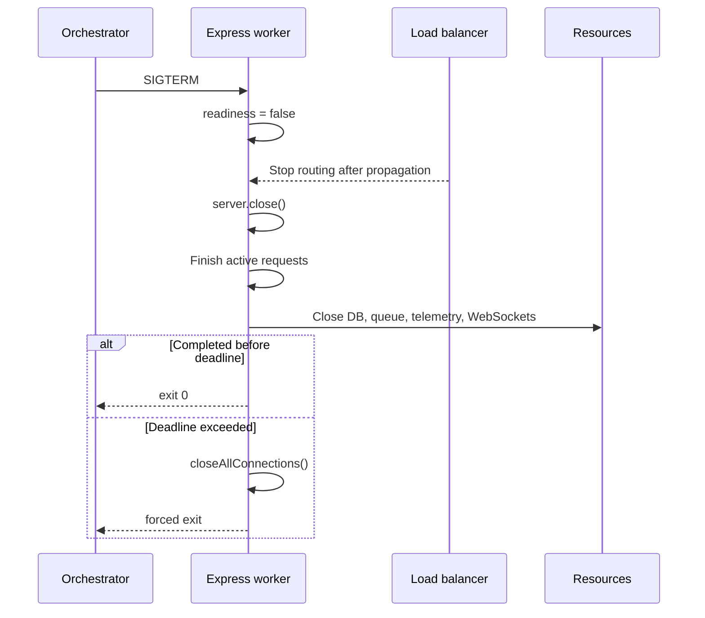

# Question 8

How do you configure graceful shutdown in a Node.js Express cluster handling thousands of active persistent connections?

## Summary
**The Problem:** During deployment or termination, keep-alive, WebSocket, SSE, and long-running requests can keep cluster workers alive indefinitely. Killing them immediately drops in-flight work and may corrupt partially completed operations.

**The Solution:** Drain in phases: mark the instance unready, stop accepting new connections, let active requests complete within a deadline, close application resources, then force-close remaining connections and exit. Coordinate this independently in every cluster worker.

## Why it matters
A load balancer may continue sending traffic briefly after readiness changes, and persistent sockets can carry multiple requests. A shutdown design therefore needs both traffic draining and a hard deadline. It must also distinguish normal HTTP connections from upgraded WebSocket connections, which `closeAllConnections()` does not close.

## Key Concepts
- **Readiness before termination:** remove a worker from routing before closing it.
- **Connection draining:** `server.close()` stops new connections and waits for active HTTP work.
- **Active-request accounting:** determines when normal work has actually completed.
- **Force deadline:** prevents shutdown from hanging forever.
- **Cluster coordination:** the primary stops distribution and asks each worker to drain before replacement.

## How to do it
1. Handle both `SIGTERM` and `SIGINT` once, with an idempotent shutdown function.
2. Change readiness to false and allow the load balancer a short propagation period.
3. Call `server.close()` to stop accepting new HTTP connections and reap idle keep-alive connections on modern Node.js versions.
4. Reject new work arriving during the drain window with `Connection: close` and `503`.
5. Wait for tracked requests and jobs to finish within a termination budget.
6. Close database pools, message consumers, schedulers, telemetry exporters, SSE streams, and WebSockets.
7. After the deadline, call `server.closeAllConnections()` and explicitly terminate upgraded sockets.
8. Let the supervisor or orchestrator restart processes; do not fork replacements during intentional pod termination.

## Shutdown sequence


## Example
```js
const server = app.listen(PORT);
let shuttingDown = false;
let activeRequests = 0;
const upgradedSockets = new Set();

app.get('/health/ready', (_req, res) => {
  res.sendStatus(shuttingDown ? 503 : 204);
});

app.use((req, res, next) => {
  if (shuttingDown) {
    res.set('Connection', 'close');
    return res.status(503).json({ error: 'Server draining' });
  }

  activeRequests += 1;
  let counted = true;
  const done = () => {
    if (!counted) return;
    counted = false;
    activeRequests -= 1;
  };
  res.once('finish', done);
  res.once('close', done);
  next();
});

server.on('upgrade', (_req, socket) => {
  upgradedSockets.add(socket);
  socket.once('close', () => upgradedSockets.delete(socket));
});

async function shutdown(signal) {
  if (shuttingDown) return;
  shuttingDown = true;
  logger.info({ signal }, 'shutdown started');

  const deadline = setTimeout(() => {
    server.closeAllConnections();
    for (const socket of upgradedSockets) socket.destroy();
    process.exit(1);
  }, 25_000).unref();

  await delay(2_000); // Readiness propagation; keep below platform grace period.
  await new Promise((resolve) => server.close(resolve));
  await Promise.allSettled([
    databasePool.end(),
    messageConsumer.close(),
    telemetry.shutdown(),
  ]);

  clearTimeout(deadline);
  process.exit(0);
}

process.once('SIGTERM', () => void shutdown('SIGTERM'));
process.once('SIGINT', () => void shutdown('SIGINT'));
```

Mount the draining middleware before application routes; otherwise it cannot reject new work. In an actual cluster, the primary sends a drain message or signal to each worker and waits for their exits.

## Additional details
- The platform termination grace period must exceed readiness propagation plus the application's drain deadline.
- Make request handlers idempotent because a client may retry after a connection closes without receiving the response.
- Stop queue consumption early so new background jobs do not extend shutdown.
- For WebSockets, send a protocol close frame first, then destroy remaining sockets at the deadline.
- `server.closeAllConnections()` is forceful and does not close upgraded WebSocket or HTTP/2 sessions.
- Do not accept new work merely because it arrived on an existing keep-alive connection during draining.

## Why this helps
- Deployments stop routing traffic before processes disappear.
- In-flight financial operations get time to commit or roll back cleanly.
- A fixed deadline prevents stuck sockets from blocking replacement indefinitely.
- Idempotent shutdown tolerates repeated signals safely.

## Trade-offs
| Aspect | Impact | Description |
|---|---|---|
| Drain period | Positive | Preserves requests but slows rollout and scale-down. |
| Force deadline | Necessary | Guarantees termination but may interrupt unusually long work. |
| Connection tracking | Cost | Improves control but adds state and cleanup paths. |
| Persistent protocols | Cost | WebSocket and SSE require protocol-specific shutdown logic. |
| Cluster coordination | Cost | Every worker needs lifecycle reporting and timeout handling. |

## References
- [Express health checks and graceful shutdown](https://expressjs.com/en/advanced/healthcheck-graceful-shutdown.html)
- [Node.js HTTP server connection APIs](https://nodejs.org/api/http.html#serverclosecallback)
- [Node.js Cluster documentation](https://nodejs.org/api/cluster.html)

