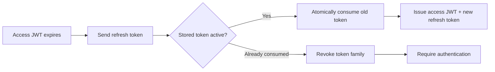

# Question 11

How do you implement secure, stateless JWT authentication with automated refresh token rotation in distributed Node.js services?

## Summary
**The Problem:** Stateless access JWTs scale well, but stolen tokens remain usable until expiry. Long-lived refresh tokens are even more valuable and can be replayed across any service instance.

**The Solution:** Let APIs verify short-lived asymmetric access tokens locally, while a centralized authorization service rotates opaque refresh tokens atomically. Store only hashed refresh-token records and revoke the entire token family when reuse is detected.

## Why it matters
“Stateless JWT authentication” should describe access-token verification, not the complete session lifecycle. Secure rotation, logout, device management, and replay detection require shared authorization state. Keeping that state only at the refresh boundary preserves fast distributed API verification.

## Key Concepts
- **Short-lived access JWT:** signed token with narrow audience, scope, issuer, and expiration.
- **Opaque refresh token:** high-entropy secret stored hashed at the authorization server.
- **Token family:** chain of refresh tokens created from one login grant.
- **Rotation:** every successful refresh invalidates the presented token and returns a new one.
- **Reuse detection:** replay of an already-consumed token revokes the active family.

## How to do it
1. Issue access tokens with `iss`, `sub`, `aud`, `iat`, `exp`, `jti`, scopes, and a signing-key `kid`.
2. Keep access-token lifetime short and verify signature, algorithm, issuer, audience, and time claims at every API.
3. Generate refresh tokens from at least 256 bits of cryptographic randomness; never encode user claims in them.
4. Store a keyed hash of each refresh token with family ID, status, expiry, client/device binding, and successor ID.
5. Rotate inside one database transaction or atomic compare-and-set operation.
6. If a consumed token is presented again, revoke the entire family and require login.
7. Serialize concurrent refreshes per token or support a very small, carefully designed idempotency window.
8. Put browser refresh tokens in `Secure`, `HttpOnly`, appropriately `SameSite` cookies and protect the refresh endpoint against CSRF.

## Flow


## Example
```js
import { createHmac, randomBytes } from 'node:crypto';

const digest = (token) =>
  createHmac('sha256', process.env.REFRESH_TOKEN_PEPPER)
    .update(token)
    .digest('hex');

async function rotateRefreshToken(presentedToken, clientId) {
  return database.transaction(async (tx) => {
    const record = await tx.refreshTokens.lockByHash(digest(presentedToken));
    if (!record || record.clientId !== clientId || record.expiresAt <= new Date()) {
      throw new InvalidGrantError();
    }

    if (record.status !== 'active') {
      await tx.refreshTokens.revokeFamily(record.familyId, 'reuse_detected');
      throw new InvalidGrantError();
    }

    const next = randomBytes(32).toString('base64url');
    const successor = await tx.refreshTokens.insert({
      hash: digest(next), familyId: record.familyId, clientId,
      status: 'active', expiresAt: record.expiresAt,
    });
    await tx.refreshTokens.consume(record.id, successor.id);

    return { accessToken: await issueAccessToken(record.subject), refreshToken: next };
  });
}
```

## Additional details
- Use asymmetric signing so resource services receive public keys, never signing secrets.
- Hash refresh tokens with a server-held pepper so a database leak is less immediately useful.
- Rate-limit login and refresh endpoints and log family revocations without logging tokens.
- Handle legitimate concurrent browser refreshes deliberately; otherwise they resemble theft.
- Consider DPoP or mTLS sender-constrained tokens for higher-risk clients.

## Why this helps
- API services verify access locally without a database call on every request.
- Atomic rotation detects replay across every replica.
- Short access lifetime limits the window before distributed revocation takes effect.
- Family revocation contains theft without affecting unrelated devices.

## Trade-offs
| Aspect | Impact | Description |
|---|---|---|
| Stateless access JWTs | Positive | Fast local verification, but valid until expiry. |
| Rotation database | Cost | Adds shared state and transactional writes at refresh time. |
| Reuse detection | Positive | Detects replay but can sign out a legitimate client after a race. |
| Short access lifetime | Mixed | Shrinks risk window but increases refresh traffic. |
| Sender constraint | Positive | Reduces replay but adds key and client complexity. |

## References
- [OAuth 2.0 Security Best Current Practice (RFC 9700)](https://www.rfc-editor.org/rfc/rfc9700.html)
- [JSON Web Token (RFC 7519)](https://www.rfc-editor.org/rfc/rfc7519.html)
- [OAuth Token Revocation (RFC 7009)](https://www.rfc-editor.org/rfc/rfc7009.html)

