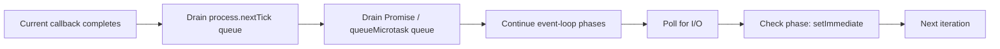

# Question 3

How does the Node.js event loop handle `process.nextTick` microtasks versus `setImmediate` timers under extreme concurrent API load?

## Summary
**The Problem:** `process.nextTick()` and `setImmediate()` defer callbacks, but they run at different priorities. Under heavy load, excessive `nextTick` callbacks can starve I/O, timers, and `setImmediate` callbacks.

**The Solution:** Reserve `process.nextTick()` for tiny compatibility or post-stack actions, prefer `queueMicrotask()` for portable microtasks, and use `setImmediate()` to yield so the event loop can process I/O between chunks of work.

## Why it matters
The name `nextTick` is misleading: it runs before the event loop advances to its next phase. Node drains the next-tick queue after the current JavaScript operation, then processes regular microtasks such as resolved Promise handlers. `setImmediate()` runs later, in the event loop's check phase, after polling for I/O.

Under extreme concurrency, recursively scheduling `nextTick` work keeps producing high-priority callbacks. The process remains busy while sockets and timers wait, causing large p99 latency without necessarily showing 100% CPU.

## Key Concepts
- **Next-tick queue:** Node-specific, high-priority queue drained before the event loop continues.
- **Microtask queue:** used by `queueMicrotask()` and Promise reactions; also runs before another event-loop phase.
- **Check phase:** the phase in which `setImmediate()` callbacks run, normally after the poll phase.
- **Starvation:** continuously replenishing a higher-priority queue prevents lower-priority I/O and timers from progressing.
- **Cooperative yielding:** splitting work and using `setImmediate()` gives pending I/O a chance to run.

## How to do it
1. Do not recursively process arbitrary queues with `process.nextTick()`.
2. Keep every callback short and bound the amount of work performed per turn.
3. Prefer `queueMicrotask()` when microtask semantics are actually required; current Node.js documentation marks `process.nextTick()` as legacy.
4. Use `setImmediate()` between batches of CPU-light synchronous work to yield to I/O.
5. Move genuinely CPU-heavy work to a Worker Thread pool instead of repeatedly yielding it on the main thread.
6. Track event-loop delay and p95/p99 request latency during load tests.

## Execution order


Exact ordering can depend on where callbacks are scheduled, especially at top-level versus inside an I/O callback. The important guarantee for design is that `nextTick` runs before the event loop proceeds, while `setImmediate` yields to it.

## Example
This version can starve I/O because every callback schedules another high-priority callback:

```js
function drainQueueBad(queue) {
  if (queue.length === 0) return;
  handle(queue.shift());
  process.nextTick(() => drainQueueBad(queue));
}
```

Process a bounded batch and yield through the check phase instead:

```js
const BATCH_SIZE = 100;

function drainQueueFairly(queue) {
  let processed = 0;

  while (queue.length > 0 && processed < BATCH_SIZE) {
    handle(queue.shift());
    processed += 1;
  }

  if (queue.length > 0) {
    setImmediate(() => drainQueueFairly(queue));
  }
}
```

## Additional details
- Both `nextTick` and Promise microtasks can starve the event loop if recursively replenished.
- `setTimeout(fn, 0)` runs in the timers phase and has delay clamping; it is not an exact substitute for `setImmediate()`.
- Inside an I/O callback, `setImmediate()` normally runs before a zero-delay timer scheduled from that callback.
- In ES modules, surrounding microtask execution can affect observed ordering between `nextTick` and Promise callbacks.
- Neither scheduling API makes CPU-heavy code parallel.

## Why this helps
- I/O callbacks receive regular opportunities to execute.
- Tail latency remains stable when request concurrency rises.
- Bounded batches prevent one request or internal queue from monopolizing the process.
- Clear scheduling intent makes timing bugs easier to diagnose.

## Trade-offs
| Aspect | Impact | Description |
|---|---|---|
| `process.nextTick()` | Very low deferral latency | Can starve the entire event loop when recursively scheduled. |
| `queueMicrotask()` | Standards-aligned microtask | Still runs before event-loop phases and can also starve I/O. |
| `setImmediate()` | Fairer to I/O | Adds an event-loop turn and therefore some latency. |
| Batching | Predictable fairness | Requires tuning batch size for throughput versus latency. |
| Worker Threads | True CPU parallelism | Adds communication and worker-pool complexity. |

## References
- [Node.js `process.nextTick()` documentation](https://nodejs.org/api/process.html#processnexttickcallback-args)
- [Node.js event-loop guide](https://nodejs.org/en/learn/asynchronous-work/event-loop-timers-and-nexttick)
- [Node.js timers documentation](https://nodejs.org/api/timers.html#setimmediatecallback-args)

