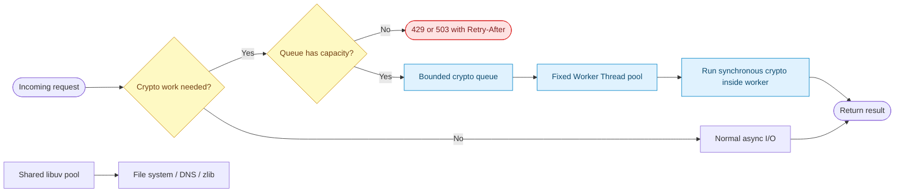

# Question 1

How do you prevent thread pool starvation in Node.js when executing heavy cryptographic operations alongside async I/O tasks?

## Summary
**The Problem:** Many asynchronous crypto operations run in Node.js's shared libuv thread pool. Expensive calls such as `crypto.pbkdf2()`, `crypto.scrypt()`, and key generation can occupy every worker, delaying unrelated file-system operations, `dns.lookup()`, compression, and other work that uses the same pool.

**The Solution:** Keep synchronous crypto off the event loop, bound crypto concurrency, and isolate sustained CPU-heavy work in a fixed pool of Worker Threads or a separate service. Tune `UV_THREADPOOL_SIZE` only after measuring; increasing it is extra capacity, not a substitute for admission control and isolation.

## Why it matters
Calling an asynchronous API prevents the event loop from blocking, but it does not make the underlying work free. Several Node.js APIs submit work to one process-wide libuv pool. If requests can enqueue expensive crypto jobs without a limit, short I/O tasks wait behind them and tail latency grows sharply.

- **Promises do not create isolation:** `await scrypt(...)` still uses the shared libuv pool.
- **Not all I/O competes for the pool:** socket and most network I/O use operating-system readiness mechanisms, while file-system APIs and `dns.lookup()` commonly use libuv workers.
- **Synchronous crypto is worse on the main thread:** it blocks the event loop, so no request callbacks can run.
- **Unbounded queues are dangerous:** they consume memory, increase latency, and make denial-of-service attacks easier.

## Key Concepts
- **Shared libuv worker pool:** asynchronous crypto, file-system work, `dns.lookup()`, and zlib can compete for the same finite workers.
- **Worker Thread isolation:** CPU-heavy synchronous crypto can run in separate JavaScript threads without blocking the main event loop or occupying its libuv pool.
- **Bounded concurrency:** a semaphore or job queue limits how many expensive operations may run at once.
- **Backpressure:** when capacity is exhausted, reject, delay, or rate-limit new work instead of building an unlimited in-memory queue.
- **Capacity testing:** pool and queue sizes must be selected from CPU, memory, throughput, and p95/p99 latency measurements.

## How to do it
1. Inventory calls to `crypto`, `fs`, `dns.lookup()`, and `zlib`, and identify which ones use the libuv worker pool.
2. Never call `pbkdf2Sync()`, `scryptSync()`, or similar expensive synchronous functions on the main request thread.
3. Put sustained or user-triggerable crypto work in a reusable, fixed-size Worker Thread pool. Do not create a new Worker for every request.
4. Set the worker-pool concurrency near the CPU capacity available to the container, leaving headroom for the event loop and other processes.
5. Place a bounded queue in front of the workers. Return `429 Too Many Requests` or `503 Service Unavailable` when it is full.
6. If asynchronous crypto remains on libuv, limit concurrent submissions and load-test a larger `UV_THREADPOOL_SIZE`. Set it before Node.js starts.
7. Cache or precompute safe, reusable results where the security model permits, and avoid unnecessarily expensive parameters.
8. Monitor event-loop delay, crypto queue depth, active jobs, job duration, rejection count, CPU saturation, and I/O p95/p99 latency.

## Architecture


The dedicated Worker Thread pool absorbs CPU-bound crypto work. The main event loop remains responsive, and unrelated tasks are not forced to wait behind crypto jobs in the shared libuv pool.

## Example
The example below uses a worker-pool library because production code should reuse workers, enforce queue limits, and handle worker failures rather than spawning one thread per request.

```js
// crypto-worker.js
import { scryptSync } from 'node:crypto';

export default function deriveKey({ password, salt }) {
  // This blocks only this Worker Thread, not the application's main event loop.
  return scryptSync(password, salt, 64).toString('hex');
}
```
XV
```js
// crypto-pool.js
import os from 'node:os';
import { fileURLToPath } from 'node:url';
import Piscina from 'piscina';

const availableCpus = os.availableParallelism();

export const cryptoPool = new Piscina({
  filename: fileURLToPath(new URL('./crypto-worker.js', import.meta.url)),
  minThreads: 1,
  maxThreads: Math.max(1, availableCpus - 1),
  // Bound queued work so overload produces backpressure instead of memory growth.
  maxQueue: Math.max(4, availableCpus * 4),
});
```

```js
// route.js
import express from 'express';
import { randomBytes } from 'node:crypto';
import { cryptoPool } from './crypto-pool.js';

const app = express();
app.use(express.json({ limit: '8kb' }));

app.post('/derive-key', async (req, res) => {
  if (cryptoPool.queueSize >= cryptoPool.options.maxQueue) {
    res.set('Retry-After', '1');
    return res.status(503).json({ error: 'Crypto capacity exhausted' });
  }

  try {
    const salt = randomBytes(16).toString('hex');
    const key = await cryptoPool.run({ password: req.body.password, salt });
    return res.json({ key, salt });
  } catch (error) {
    return res.status(500).json({ error: 'Key derivation failed' });
  }
});
```

If the application performs only occasional short asynchronous crypto calls, a concurrency limit plus a tested libuv pool size may be sufficient:

```bash
# Configure this in the process/container environment before Node.js starts.
UV_THREADPOOL_SIZE=8 node server.js
```

Do not set the value blindly. Too many threads cause context switching, memory overhead, and CPU contention, and they cannot make CPU-bound work exceed the machine's actual compute capacity.

## Additional details
- Use a rate limiter per tenant or account so one client cannot consume every crypto slot.
- Give latency-sensitive and batch work separate queues. Batch key derivation should not delay authentication requests.
- A separate crypto service provides stronger resource isolation when crypto volume is high or independently scalable.
- Use the algorithm and cost parameters required by the security design. Reducing password-hashing cost merely to improve latency can weaken security.
- Prefer `dns.resolve*()` when its DNS semantics are suitable because it uses the network resolver rather than `dns.lookup()`'s libuv-pool path.
- Treat queue wait time separately from execution time in metrics; a fast crypto operation can still have poor end-to-end latency when queued.

## Why this helps
- The main event loop remains available to accept connections and run callbacks.
- Dedicated workers stop heavy crypto from monopolizing the libuv threads needed by unrelated APIs.
- A bounded queue makes overload predictable and protects memory.
- Backpressure preserves useful throughput instead of allowing every request to become slow.
- Measurements reveal whether the bottleneck is queueing, CPU, libuv capacity, or downstream I/O.

## Trade-offs
| Aspect | Impact | Description |
|---|---|---|
| Worker Threads | Positive | Isolate CPU-heavy work and keep the event loop responsive. |
| Worker pool | Cost | Adds lifecycle, error-handling, serialization, and observability complexity. |
| Bounded queue | Mixed | Protects the service but rejects or delays requests during overload. |
| Larger `UV_THREADPOOL_SIZE` | Mixed | May reduce queueing for mixed libuv work, but increases memory and context switching. |
| Separate crypto service | Mixed | Gives strong isolation and independent scaling at the cost of network and operational overhead. |
| Strong crypto parameters | Necessary cost | Improve security but consume CPU and increase latency; capacity must be designed around them. |

## References
- [Node.js: Don't Block the Event Loop (or the Worker Pool)](https://nodejs.org/en/learn/asynchronous-work/dont-block-the-event-loop)
- [Node.js Worker Threads documentation](https://nodejs.org/api/worker_threads.html)
- [Node.js Crypto documentation](https://nodejs.org/api/crypto.html)
- [Node.js CLI documentation: `UV_THREADPOOL_SIZE`](https://nodejs.org/api/cli.html#uv_threadpool_sizesize)
