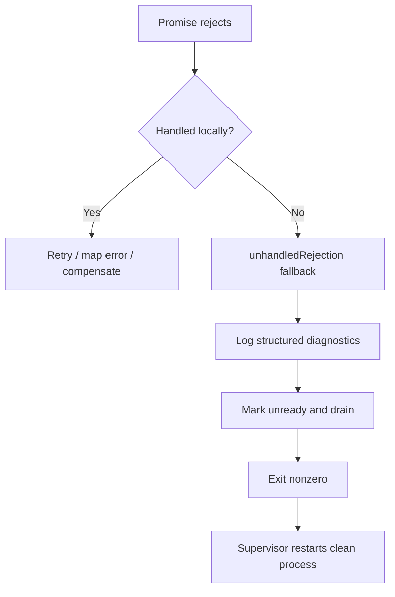

# Question 10

How do you handle unhandled promise rejections gracefully in production Node.js applications without causing process crashes?

## Summary
**The Problem:** A rejected Promise without a handler indicates a missing error boundary. Depending on runtime behavior and flags, it can terminate the process; continuing blindly may leave application state uncertain.

**The Solution:** Handle expected failures at route, job, and detached-task boundaries. Use the process-level `unhandledRejection` event only for last-resort logging and controlled shutdown, then rely on a supervisor to restart the process. Do not treat the global handler as recovery.

## Why it matters
Preventing every crash is the wrong reliability target. The goal is to avoid unhandled rejections through structured error handling, preserve diagnostic evidence when one escapes, stop accepting new work, drain safely, and restart into a known state.

## Key Concepts
- **Local error boundary:** the layer that understands whether to retry, translate, compensate, or fail.
- **Detached Promise:** background work whose Promise is not awaited must still have an explicit `.catch()`.
- **Fatal fallback:** an unhandled rejection is generally treated as a programming defect, not a normal business error.
- **Graceful termination:** stop traffic, close resources, and exit within a deadline.
- **Supervisor restart:** containers, systemd, or another manager restores availability after exit.

## How to do it
1. Await or return every Promise that belongs to a request, job, or startup operation.
2. Catch errors where the code has enough context to decide retry, HTTP mapping, or compensation.
3. In Express 5, rejected Promises from async middleware are forwarded to error handling; still use a final error middleware.
4. Attach `.catch()` immediately to intentional fire-and-forget work and send failures to a durable job system when reliability matters.
5. Register one process-level `unhandledRejection` handler during startup for structured logging and shutdown initiation.
6. Stop accepting traffic, drain connections, flush telemetry with a deadline, and exit nonzero.
7. Run under a supervisor and protect restart loops with readiness checks and backoff.
8. Test rejection paths and fail CI on warnings or floating Promises using lint rules.

## Error boundaries


## Example
```js
// Express 5 forwards rejected async handlers to this error middleware.
app.post('/transfers', async (req, res) => {
  const transfer = await transferService.create(req.body);
  res.status(201).json(transfer);
});

app.use((error, req, res, _next) => {
  logger.error({ error, requestId: req.id }, 'request failed');

  if (res.headersSent) {
    res.destroy(error);
    return;
  }

  res.status(toHttpStatus(error)).json({
    error: safePublicMessage(error),
    requestId: req.id,
  });
});
```

Handle detached work explicitly:

```js
// Deliberately detached, but never unobserved.
void auditPublisher.publish(event).catch((error) => {
  logger.error({ error, eventId: event.id }, 'audit publish failed');
  fallbackQueue.enqueue(event);
});
```

Use the global event only as a fatal safety net:

```js
let terminating = false;

process.on('unhandledRejection', (reason, promise) => {
  logger.fatal({ reason, promise }, 'unhandled promise rejection');
  void terminateSafely();
});

async function terminateSafely() {
  if (terminating) return;
  terminating = true;
  readiness.set(false);

  const forceExit = setTimeout(() => process.exit(1), 10_000);
  forceExit.unref();

  try {
    await Promise.allSettled([
      closeHttpServer(),
      databasePool.end(),
      telemetry.shutdown(),
    ]);
  } finally {
    process.exit(1);
  }
}
```

## Additional details
- Do not log and continue indefinitely from `unhandledRejection`; unknown state may already have escaped the intended control flow.
- Do not throw again inside the handler without a coordinated shutdown path; that can lose logs and abruptly cut requests.
- Never log secrets, credentials, full financial payloads, or raw authorization headers with the rejection.
- A late handler can produce a `rejectionHandled` event, but relying on late attachment makes behavior timing-dependent.
- Retries require bounded attempts, backoff, jitter, and idempotency. Not every rejection is retryable.
- Startup rejection should fail startup and leave readiness false rather than serving a partially initialized application.

## Why this helps
- Expected operational failures become normal controlled responses or retries.
- Programming defects produce actionable diagnostics instead of silent corruption.
- Graceful draining reduces impact on in-flight requests.
- Automatic restart restores a known-good process state.

## Trade-offs
| Aspect | Impact | Description |
|---|---|---|
| Local catches | Positive | Best recovery context, but require disciplined Promise ownership. |
| Fatal global fallback | Mixed | Preserves correctness but briefly reduces capacity during restart. |
| Fire-and-forget `.catch()` | Necessary | Observes failure but is not durable by itself. |
| Durable queue | Positive | Supports retries and recovery at additional infrastructure cost. |
| Graceful shutdown | Positive | Preserves in-flight work but needs a strict timeout. |

## References
- [Node.js Process events: `unhandledRejection`](https://nodejs.org/api/process.html#event-unhandledrejection)
- [Express error handling](https://expressjs.com/en/guide/error-handling.html)
- [Express production reliability practices](https://expressjs.com/en/advanced/best-practice-performance.html)
- [Node.js HTTP server shutdown APIs](https://nodejs.org/api/http.html#serverclosecallback)
