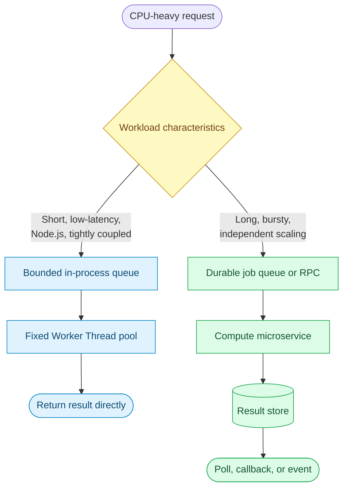

# Question 2

What are the architectural tradeoffs of using Node.js `worker_threads` versus spinning up separate microservices for heavy CPU tasks?

## Summary
**The Problem:** Heavy CPU work blocks Node.js's main event loop when it runs in request handlers. This increases latency for every request handled by that process, even when the CPU task is unrelated.

**The Solution:** Move CPU work either to a bounded `worker_threads` pool inside the application or to a separately deployed compute service. Worker Threads provide low-latency, in-process parallelism with simpler communication. Microservices provide stronger failure isolation, independent scaling, and technology freedom, but add network and operational complexity.

## Why it matters
The choice determines more than where a calculation runs. It changes the application's scaling model, failure boundaries, deployment process, observability needs, and operating cost.

- **Worker Threads share a process:** communication is fast, but a process crash can affect both API and compute work.
- **Microservices cross a network boundary:** they cost more to operate but can fail and scale independently.
- **CPU work needs bounded concurrency:** either design can overload the host if it accepts unlimited jobs.
- **Workload shape matters:** short interactive tasks and long-running batch jobs have different needs.
- **Team structure matters:** a separate service introduces ownership, deployment, versioning, and on-call responsibilities.

## Key Concepts
- **Event-loop protection:** CPU-intensive work must not execute on the main JavaScript thread.
- **Isolation boundary:** Worker Threads isolate JavaScript execution; processes or services also isolate memory, crashes, deployments, and often infrastructure.
- **Communication overhead:** workers use structured cloning, transferable objects, or shared memory; services serialize data and send it over IPC or a network.
- **Scaling granularity:** an in-process pool scales with the API replica, while a compute service scales independently.
- **Backpressure:** both approaches need bounded queues, timeouts, cancellation, and overload behavior.

## How to choose
1. Measure task duration, input size, memory use, arrival rate, and acceptable end-to-end latency.
2. Use a fixed Worker Thread pool when tasks are relatively short, tightly coupled to the API, use Node.js libraries, and should return within the request lifecycle.
3. Prefer a compute microservice when tasks are long-running, bursty, memory-intensive, require different hardware or languages, or must scale independently.
4. Use an asynchronous job queue when the caller does not need an immediate result. This can sit in front of workers or a microservice.
5. Define queue limits, per-tenant quotas, timeouts, cancellation rules, retries, and idempotency before accepting production traffic.
6. Benchmark serialization and transfer costs with realistic payloads. Large copied objects can remove the latency advantage of Worker Threads.
7. Test failure behavior: worker crashes, process crashes, service unavailability, duplicate delivery, and deployment incompatibility.
8. Start with the smallest boundary that satisfies the requirements, but keep the compute contract explicit so it can be extracted later if needed.

## Decision table
| Requirement | Worker Thread pool | Separate microservice |
|---|---|---|
| Very low communication latency | Strong fit | Network/IPC overhead |
| Independent compute scaling | Limited | Strong fit |
| Strong crash and memory isolation | Limited | Strong fit |
| Simple local development | Easier | Harder |
| Different language or runtime | Poor fit | Strong fit |
| Specialized CPU/GPU hardware | Awkward | Strong fit |
| Shared in-memory data | Possible | Not directly possible |
| Independent deployments | No | Yes |
| Long-running asynchronous jobs | Possible with extra infrastructure | Natural fit with a queue |
| Few operational resources | Strong fit | Higher operational burden |

## Architecture


## Example
For short image transformations that must finish during the HTTP request, a fixed Worker Thread pool avoids blocking the event loop without adding a network hop:

```js
// image-pool.js
import os from 'node:os';
import { fileURLToPath } from 'node:url';
import Piscina from 'piscina';

export const imagePool = new Piscina({
  filename: fileURLToPath(new URL('./image-worker.js', import.meta.url)),
  maxThreads: Math.max(1, os.availableParallelism() - 1),
  maxQueue: 32,
});
```

```js
// image-worker.js
import sharp from 'sharp';

export default async function resize({ input, width }) {
  return sharp(input).resize({ width }).webp().toBuffer();
}
```

```js
// route.js
app.post('/thumbnail', upload.single('image'), async (req, res) => {
  if (imagePool.queueSize >= 32) {
    return res.status(503).set('Retry-After', '2').end();
  }

  const output = await imagePool.run({ input: req.file.buffer, width: 320 });
  res.type('image/webp').send(output);
});
```

For multi-minute video encoding, a durable queue and separate compute service are a better boundary:

```js
// API service: accept work quickly and return a job identifier.
app.post('/video-jobs', async (req, res) => {
  const job = await jobs.create({
    sourceUrl: req.body.sourceUrl,
    status: 'queued',
  });

  await queue.publish('video.encode', {
    jobId: job.id,
    sourceUrl: job.sourceUrl,
    idempotencyKey: `video:${job.id}`,
  });

  res.status(202).json({ jobId: job.id, statusUrl: `/video-jobs/${job.id}` });
});
```

```js
// Compute service: scale these consumers independently from the API.
queue.consume('video.encode', async (message) => {
  const { jobId, sourceUrl } = message;

  if (await jobs.isComplete(jobId)) return; // Safe duplicate delivery.

  const outputUrl = await encodeVideo(sourceUrl);
  await jobs.markComplete(jobId, outputUrl);
});
```

The service example deliberately uses `202 Accepted`: the API request is not held open for a long computation, and the durable queue survives API or worker restarts.

## Additional details
- A Worker Thread has its own V8 isolate and event loop, but it remains inside the same operating-system process.
- Workers can transfer `ArrayBuffer` ownership without copying. `SharedArrayBuffer` can be faster but introduces synchronization and data-race risks.
- Creating one Worker per request is expensive. Reuse a small pool and keep its queue bounded.
- A microservice does not require one service per algorithm. Group computations that share scaling, security, data, and ownership characteristics.
- RPC is suitable for short synchronous computations. Durable messaging is safer for long tasks that need retries and recovery.
- Queue consumers must handle at-least-once delivery with idempotency keys or transactional deduplication.
- Apply deadlines and cancellation. A disconnected client should not leave unnecessary in-process work running, while durable jobs need an explicit cancellation state.
- Measure queue wait time, execution time, CPU utilization, memory, failure rate, and p95/p99 end-to-end latency for either design.

## Why this helps
- Worker Threads add CPU parallelism while retaining a simple deployment and low communication latency.
- A separate service prevents compute spikes from consuming all API resources.
- Independent scaling avoids paying for additional API replicas merely to gain compute capacity.
- An explicit compute contract makes later extraction or consolidation easier.
- Bounded queues and backpressure protect both designs during traffic spikes.

## Trade-offs
| Aspect | Worker Threads | Separate microservice |
|---|---|---|
| Latency | Lower; no network hop | Higher due to serialization and transport |
| Failure isolation | Worker errors can be contained, but a fatal process failure affects everything | Separate process/container failure boundary |
| Scaling | Coupled to each application replica | Compute replicas scale independently |
| Memory | Lower infrastructure overhead, though each Worker has a V8 isolate | Higher process, container, and platform overhead |
| Data transfer | Structured clone, transfer list, or shared memory | Network serialization or shared external storage |
| Deployment | One application artifact | Multiple deployable artifacts and compatibility concerns |
| Technology choice | JavaScript/Node.js | Any suitable language, runtime, or hardware |
| Operations | Simpler tracing and local setup | Requires discovery, authentication, retries, tracing, and on-call ownership |
| Durability | In-memory jobs disappear with the process unless externally queued | Durable queues and result stores fit naturally |
| Security | Same process and trust boundary | Stronger network and identity boundary, with more security configuration |

## References
- [Node.js Worker Threads documentation](https://nodejs.org/api/worker_threads.html)
- [Node.js: Don't Block the Event Loop (or the Worker Pool)](https://nodejs.org/en/learn/asynchronous-work/dont-block-the-event-loop)
- [Node.js `AsyncResource` and Worker Thread pools](https://nodejs.org/api/async_context.html#using-asyncresource-for-a-worker-thread-pool)
- [Kubernetes documentation: Horizontal Pod Autoscaling](https://kubernetes.io/docs/tasks/run-application/horizontal-pod-autoscale/)
