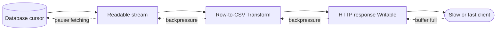

# Question 5

How do you implement backpressure handling in Node.js streams when piping massive financial datasets to client responses?

## Summary
**The Problem:** A database or file source can produce financial records faster than a client can receive them. Ignoring backpressure buffers data in memory, increases garbage collection, and can crash the process or expose it to denial of service.

**The Solution:** Build a streaming pipeline from a paged/cursor source through bounded transforms to the HTTP response. Let `pipeline()` propagate backpressure and errors, or stop writing whenever `res.write()` returns `false` and resume only after `drain`.

## Why it matters
Massive exports must use memory proportional to configured buffer sizes, not total dataset size. Slow clients, proxies, TLS, and network congestion are normal, so the producer must slow down with the consumer.

## Key Concepts
- **Backpressure signal:** `Writable.write()` returns `false` when its internal buffer reaches the high-water mark.
- **`drain` event:** tells a manual producer that buffered writes have fallen enough to resume.
- **`pipeline()`:** connects streams, forwards backpressure, propagates errors, and destroys the chain on failure.
- **Cursor/pagination:** prevents the database driver from materializing the complete result set.
- **Abort propagation:** stops database reads when the client disconnects.

## How to do it
1. Read records from a database cursor, keyset-paginated iterator, or file stream.
2. Transform one record at a time into CSV, NDJSON, or another incremental format.
3. Use `stream.pipeline()` rather than manually wiring multiple `.pipe()` and error handlers.
4. Choose bounded `highWaterMark` values and benchmark them; larger buffers trade memory for throughput.
5. Abort the source query and destroy streams when the request closes.
6. Set headers before streaming because an error after headers are sent cannot become a normal JSON error response.
7. Apply export limits, authentication, timeouts, and concurrency quotas.
8. Track active exports, bytes sent, duration, aborts, queue time, and memory.

## Data flow


## Example
```js
import { Readable, Transform } from 'node:stream';
import { pipeline } from 'node:stream/promises';

function csvTransform() {
  return new Transform({
    writableObjectMode: true,
    transform(row, _encoding, callback) {
      const line = [row.id, row.accountId, row.amount, row.currency]
        .map(csvEscape)
        .join(',') + '\n';
      callback(null, line);
    },
  });
}

app.get('/exports/transactions.csv', async (req, res, next) => {
  const controller = new AbortController();
  req.once('close', () => controller.abort());

  res.set({
    'Content-Type': 'text/csv; charset=utf-8',
    'Content-Disposition': 'attachment; filename="transactions.csv"',
  });

  try {
    const rows = transactionRepository.iterate({
      tenantId: req.user.tenantId,
      signal: controller.signal,
      batchSize: 500,
    });

    await pipeline(
      Readable.from(rows, { objectMode: true, highWaterMark: 16 }),
      csvTransform(),
      res,
      { signal: controller.signal },
    );
  } catch (error) {
    if (!controller.signal.aborted && !res.headersSent) return next(error);
    if (!res.destroyed) res.destroy(error);
  }
});

function csvEscape(value) {
  const text = String(value ?? '');
  return /[",\n]/.test(text) ? `"${text.replaceAll('"', '""')}"` : text;
}
```

For manual production, honor the return value:

```js
import { once } from 'node:events';

for await (const chunk of source) {
  if (!res.write(chunk)) await once(res, 'drain');
}
res.end();
```

## Additional details
- Never continue calling `write()` after it returns `false`; a non-reading client may cause unbounded buffering.
- Use an exact decimal representation from the database and deterministic CSV formatting for financial values.
- Avoid offset pagination on mutable large tables; a repeatable snapshot or keyset cursor gives more stable exports.
- For multi-gigabyte or retryable exports, generate an object asynchronously and return a signed download URL rather than holding an HTTP connection open.
- Compression is also a transform and must remain inside the pipeline so it participates in backpressure.

## Why this helps
- Memory remains bounded even for datasets much larger than the process heap.
- Slow clients naturally slow the database producer.
- Disconnects promptly release database cursors and other resources.
- `pipeline()` gives one completion/error boundary for the entire export.

## Trade-offs
| Aspect | Impact | Description |
|---|---|---|
| Streaming | Positive | Bounded memory and early first byte. |
| Long HTTP response | Cost | Holds sockets and database resources for longer. |
| Small buffers | Mixed | Lower memory but potentially lower throughput. |
| Large buffers | Mixed | Better batching but more per-connection memory. |
| Async object export | Mixed | More durable and scalable but adds storage, jobs, and delayed results. |

## References
- [Node.js Streams documentation](https://nodejs.org/api/stream.html)
- [Node.js guide: Backpressuring in Streams](https://nodejs.org/en/learn/modules/backpressuring-in-streams)
- [Node.js HTTP response documentation](https://nodejs.org/api/http.html#class-httpserverresponse)

