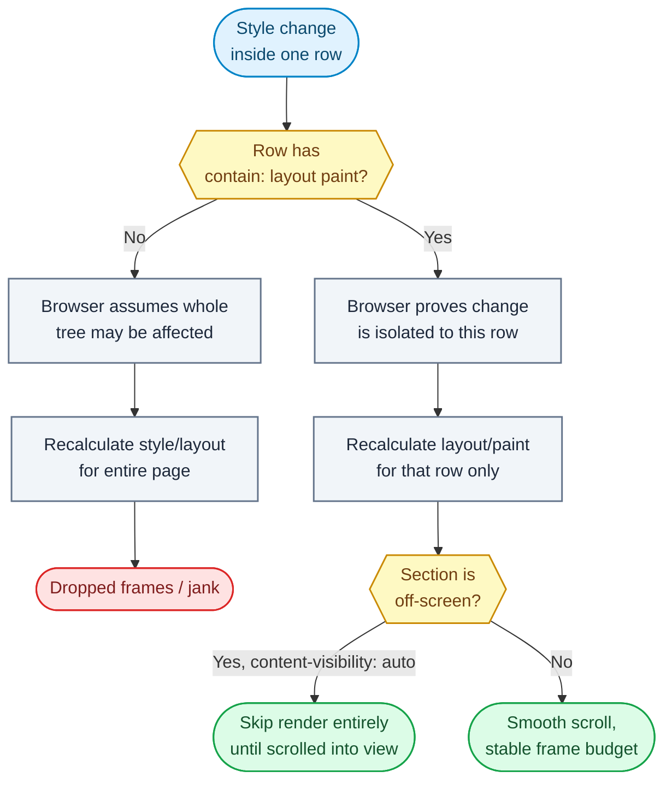

# Question 95

What specific CSS containment properties optimize rendering performance for exceptionally heavy DOM subtrees?

## Summary
**The Problem:** In a large DOM subtree (a huge table, a dashboard with hundreds of widgets, a long comment thread), a single style, layout, or paint change anywhere inside it forces the browser to recompute layout/paint for the whole subtree — and often the rest of the page — because the render engine can't prove the change is isolated.

**The Solution:** Use the CSS `contain` property (and its shorthand `content-visibility`) to explicitly tell the browser that a subtree's layout, paint, size, and/or style are independent of the rest of the document, so the rendering engine can skip recalculating what it can prove is unaffected — and, with `content-visibility: auto`, skip rendering off-screen content entirely until it's needed.

## Why it matters
Without containment hints, the browser must assume any DOM node could affect ancestor/sibling layout (e.g., via floats, margin collapsing, or size changes propagating up), so it conservatively re-lays-out far more of the tree than actually changed. On DOM subtrees with thousands of nodes (data grids, chat logs, dashboards), this turns cheap-looking updates into expensive full-tree layout/paint passes, causing dropped frames and jank.

## Flowchart


## Key Concepts
- **`contain: layout`:** the element's internal layout doesn't affect, and isn't affected by, anything outside it — enables local layout recalculation instead of global.
- **`contain: paint`:** clips descendant paint to the element's bounds and guarantees nothing outside it needs repainting because of changes inside — also establishes it as a containing block.
- **`contain: size`:** the element's size doesn't depend on its children's content, so the browser doesn't need to lay out children to know the parent's size.
- **`contain: strict` / `contain: content`:** shorthands combining `layout paint style size` (strict) or `layout paint style` (content, size not contained).
- **`content-visibility: auto`:** skips layout/paint/rendering work entirely for off-screen subtrees (like an aggressive, automatic form of virtualization), while preserving accessibility and find-in-page behavior; pairs with `contain-intrinsic-size` to avoid scrollbar jumps from unknown intrinsic size.

## How to do it
1. Identify subtrees whose internal changes should never need to affect the rest of the page's layout (widgets, rows, cards, sidebar panels).
2. Apply `contain: layout paint` (or `contain: content`) to each such subtree's root element so browser knows changes inside it are isolated.
3. For elements with a fixed/known size that doesn't depend on content (e.g., a fixed-height row), add `contain: size` (or use `strict`) to skip child-size-dependent layout.
4. For long lists/grids far larger than the viewport, apply `content-visibility: auto` to off-screen sections combined with `contain-intrinsic-size: <estimated height>` to reserve scrollbar space without rendering cost.
5. Combine with DOM virtualization (only mount visible rows) for datasets so large that even skipped-render nodes' presence in the DOM has overhead.
6. Verify with the Chrome DevTools Performance panel: containment should shrink the "Layout"/"Recalculate Style" scope shown per frame to just the changed subtree.
7. Avoid over-applying `contain: strict` to elements whose size must depend on content (e.g., auto-height cards) — it will break their intended layout.

## Example
```css
/* Each row is layout/paint isolated from its siblings and the page */
.grid-row {
  contain: layout paint;
}

/* Off-screen sections skip rendering entirely until scrolled into view */
.long-list-section {
  content-visibility: auto;
  contain-intrinsic-size: 0 500px; /* reserve estimated space */
}
```
```js
// Updating one row's data only triggers layout/paint work
// scoped to that row, not the entire 10,000-row table.
row.dataset.value = newValue;
```

## Additional details
- `contain: paint` also implicitly creates a new stacking/containing context, which can be useful (or surprising) for `position: absolute` descendants and z-index behavior.
- `content-visibility: auto` differs from `display: none`: hidden-by-content-visibility elements remain in the accessibility tree and are still findable via Ctrl+F, unlike fully removed/hidden nodes.
- Containment is a rendering-engine optimization, not a substitute for virtualization — it reduces the cost of layout/paint per node, but a DOM with 50,000 live nodes still has memory and event-handling overhead virtualization would avoid.
- Combine with `will-change` sparingly — overusing compositor layers has its own memory cost and can hurt rather than help.

## Why this helps
- Style/layout changes inside a contained subtree no longer force a full-document reflow.
- `content-visibility: auto` skips the majority of layout/paint work for content the user hasn't scrolled to yet.
- Frame budgets are easier to hit because per-interaction rendering cost scales with the changed subtree, not total DOM size.
- Scrollbar height stays stable via `contain-intrinsic-size`, avoiding layout jumps as content is un-skipped.

## Trade-offs
| Aspect | Impact | Description |
|---|---|---|
| `contain: layout paint` | Positive | Isolates reflow/repaint scope, but element must tolerate becoming a new containing block. |
| `contain: size` | Positive | Skips child-size-dependent layout, but breaks intrinsic sizing if content size varies. |
| `content-visibility: auto` | Positive | Skips rendering off-screen content cheaply, but requires a reasonable `contain-intrinsic-size` estimate to avoid scroll jank. |
| Combining with virtualization | Positive | Handles truly massive datasets, but adds mount/unmount complexity containment alone doesn't solve. |
| Over-applying `strict` | Negative | Can silently break content-dependent sizing if applied to the wrong elements. |

## References
- [MDN: CSS Containment](https://developer.mozilla.org/en-US/docs/Web/CSS/CSS_containment)
- [web.dev: content-visibility](https://web.dev/articles/content-visibility)
- [MDN: contain-intrinsic-size](https://developer.mozilla.org/en-US/docs/Web/CSS/contain-intrinsic-size)
