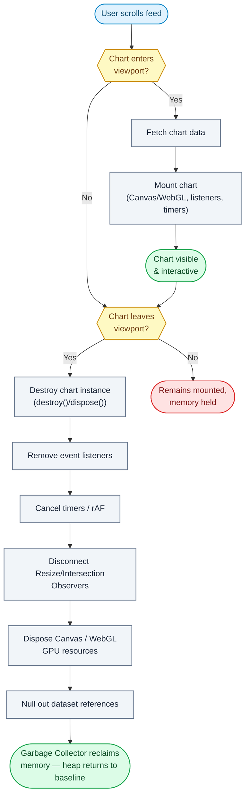

# Question 92

What are the precise memory garbage collection challenges when implementing an infinite scrolling feed of high-resolution charts?

## Summary
**The Problem:** Each high-resolution chart allocates memory across several independent layers — JS heap, DOM, Canvas/WebGL context, GPU textures, event listeners, timers, animation frames, and observers. Unmounting a React component only releases the component tree; it does not automatically release the other layers, so scrolling through hundreds of charts without explicit disposal grows the heap unbounded.

**The Solution:** Virtualize so only visible charts exist at all, lazily load each chart's dataset, and explicitly destroy every non-GC-managed resource (chart library instance, canvas/WebGL context, listeners, timers, observers) the moment a chart leaves the viewport — then verify with heap snapshots that memory returns to baseline.

## Why it matters
JavaScript's Garbage Collector only reclaims an object once nothing references it. Event listeners, `setInterval`/`requestAnimationFrame` callbacks, closures, and long-lived React state are all reference holders that can keep an entire chart (and its dataset) alive long after it has scrolled out of view. GPU memory used by WebGL textures and framebuffers isn't tracked by the JS GC at all — it must be freed explicitly via `dispose()`/`destroy()`, or it leaks even while the JS heap looks fine.

## Flowchart


## Key Concepts
- **Detached DOM nodes:** removed from the document but still referenced by a listener or closure, so they and their subtree can't be collected.
- **GPU memory is not GC'd:** WebGL textures, buffers, framebuffers, and shaders require explicit `dispose()`/`destroy()` calls from the chart library.
- **Reference chains:** a single surviving reference (timer, listener, closure, global cache) is enough to keep an entire dataset alive.
- **Virtualization:** render only charts intersecting the viewport; everything else is unmounted, not merely hidden.
- **GC pause cost:** a bloated heap makes GC scans longer and more frequent, causing frame drops and janky scrolling independent of any actual leak.

## How to do it
1. Virtualize the feed (TanStack Virtual, `react-window`) so only in-viewport charts mount; charts scrolled past are unmounted, not just hidden with CSS.
2. Lazy-load each chart's dataset from the API only when it is about to become visible; don't fetch all datasets up front.
3. On unmount, call the chart library's explicit cleanup method (`Chart.destroy()`, `echarts.dispose()`, `TradingView.remove()`, `three.js` `dispose()`), not just letting React remove the DOM node.
4. Remove every event listener (`resize`, `scroll`, pointer events) registered by the chart in the same cleanup path.
5. Clear all `setInterval`/`setTimeout` timers and cancel pending `requestAnimationFrame` callbacks tied to the chart.
6. Disconnect `ResizeObserver`/`IntersectionObserver`/`MutationObserver` instances created for that chart.
7. Null out references to the chart's dataset in React state and any global cache so nothing keeps it reachable.
8. Verify with Chrome DevTools: take a heap snapshot, scroll through hundreds of charts, force GC, take another snapshot — memory should return close to baseline.

## Example
```jsx
function ChartCell({ id }) {
  const canvasRef = useRef(null);
  const chartRef = useRef(null);

  useEffect(() => {
    let cancelled = false;

    fetchChartData(id).then((data) => {
      if (cancelled) return;
      chartRef.current = new Chart(canvasRef.current, { data });
    });

    const ro = new ResizeObserver(() => chartRef.current?.resize());
    ro.observe(canvasRef.current);

    return () => {
      cancelled = true;
      ro.disconnect();
      chartRef.current?.destroy();
      chartRef.current = null;
    };
  }, [id]);

  return <canvas ref={canvasRef} />;
}
```

## Additional details
- Storing every rendered chart in a single growing `useState`/`useReducer` array recreates the same leak at the React level — keep only the currently mounted window of data in state.
- Closures that capture a full dataset (e.g., a tooltip formatter closing over `data`) keep it alive even after the chart element is gone; capture only the fields actually needed.
- Cached decoded images (icons, heatmap thumbnails) also consume memory and should be evicted with the chart, not kept in an unbounded image cache.
- Frequent full GC runs are a symptom, not the root cause — treat rising post-GC baselines across scroll sessions as the real leak signal.

## Why this helps
- Memory usage stays roughly constant regardless of total chart count or scroll distance.
- Scrolling stays smooth because the heap never grows large enough to trigger long GC pauses.
- GPU memory is reclaimed deterministically instead of accumulating until the tab crashes.
- Heap snapshot diffs give a repeatable way to catch regressions before they reach production.

## Trade-offs
| Aspect | Impact | Description |
|---|---|---|
| Virtualization | Positive | Bounds memory to visible items, but adds scroll-position and layout-shift complexity. |
| Explicit disposal | Positive | Prevents GPU/listener leaks, but every chart library integration must implement it correctly. |
| Lazy dataset loading | Positive | Reduces peak memory, but increases number of network requests during fast scrolling. |
| Debounced fetch/dispose | Mixed | Smooths rapid scroll churn, but adds latency and extra scheduling logic. |
| Heap snapshot testing | Diagnostic cost | Catches regressions reliably, but snapshotting pauses the page and is slow to run often. |

## References
- [Chrome DevTools Memory panel](https://developer.chrome.com/docs/devtools/memory-problems/)
- [TanStack Virtual](https://tanstack.com/virtual/latest)
- [MDN: WebGL best practices](https://developer.mozilla.org/en-US/docs/Web/API/WebGL_API/WebGL_best_practices)
