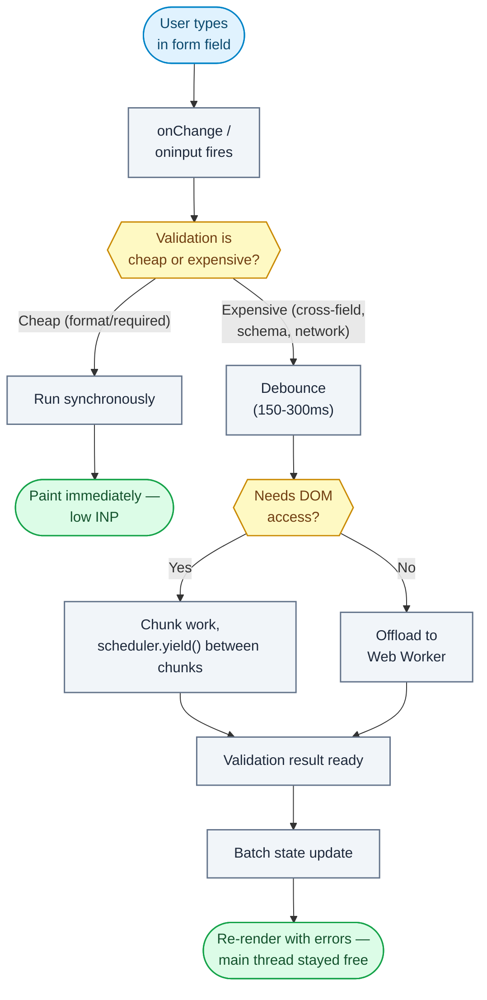

# Question 96

How do you eliminate long tasks that negatively impact Interaction to Next Paint (INP) during complex form validations?

## Summary
**The Problem:** Running expensive, synchronous validation logic (deep schema checks, cross-field validation, regex-heavy rules, large-array checks) directly inside a keystroke or blur event handler blocks the main thread for tens or hundreds of milliseconds, delaying the browser's next paint and inflating INP.

**The Solution:** Break validation work into small chunks that yield to the main thread, move genuinely expensive computation off the main thread with a Web Worker, debounce/throttle validation so it doesn't run on every keystroke, and prioritize the visual feedback (the paint) ahead of the full validation result.

## Why it matters
INP measures the latency from a user interaction to the next frame the browser paints in response — not just one event handler's callback. A single "long task" (>50ms of blocking JS) inside a form's `onChange`/`onInput` handler directly increases INP because the browser cannot paint until that JS finishes. Since INP is a Core Web Vital, form-heavy pages (checkout, settings, complex multi-field forms) are especially vulnerable if validation is naively synchronous.

## Flowchart


## Key Concepts
- **Long task:** any task occupying the main thread for more than 50ms, which blocks input processing and rendering.
- **Yielding:** deliberately breaking a long synchronous function into smaller pieces separated by points where the browser can process input/paint (`scheduler.yield()`, `setTimeout(fn, 0)`, `requestIdleCallback`).
- **Debounce/throttle validation:** run expensive full-form validation only after typing pauses, while giving cheap immediate feedback (e.g., required-field checks) synchronously.
- **Off-main-thread validation:** Web Workers can run pure validation logic (schema checks, complex regex, cross-referencing large lookup tables) without touching the main thread at all.
- **Optimistic/staged feedback:** paint the interaction's visual result (e.g., the typed character, a spinner) before the full validation result is available, then update once validation resolves.

## How to do it
1. Profile form interactions in Chrome DevTools Performance panel; identify which event handlers exceed 50ms and correlate with INP entries in the Web Vitals extension or `PerformanceObserver`.
2. Split validation into "cheap" (run synchronously, immediately, e.g. required/format checks) and "expensive" (deep cross-field, schema, or network-dependent checks).
3. Debounce expensive validation so it runs after the user pauses typing (e.g., 150–300ms), not on every keystroke.
4. For CPU-heavy expensive validation, move it into a Web Worker; post the field values in, receive validation results back via `postMessage`, and update UI state when the result arrives.
5. If validation must stay on the main thread (e.g., needs DOM access), chunk it using `scheduler.yield()` (or a `setTimeout`/`MessageChannel` polyfill) so the browser can paint and process other input between chunks.
6. Avoid synchronous, render-blocking work in the same handler that updates visible state — let the input's own re-render commit first, then run validation in a scheduled continuation.
7. Batch validation-triggered state updates so a single re-render reflects all changed error messages, instead of many cascading re-renders per field.
8. Re-measure INP with real user data (`web-vitals` library, CrUX/RUM) after changes — synthetic profiling alone can miss regressions on lower-end devices.

## Example
```js
const input = document.querySelector("#email");

input.addEventListener("input", (e) => {
  // Cheap, synchronous, immediate feedback
  showFormatHint(e.target.value);

  // Expensive validation deferred and debounced
  scheduleValidation(e.target.value);
});

const scheduleValidation = debounce((value) => {
  if ("scheduler" in window && "yield" in scheduler) {
    runChunkedValidation(value); // yields between chunks
  } else {
    validationWorker.postMessage({ type: "VALIDATE_EMAIL", value });
  }
}, 200);

validationWorker.onmessage = (e) => {
  renderFieldError(e.data.field, e.data.error);
};
```

## Additional details
- `scheduler.yield()` (Prioritized Task Scheduling API) is the modern, purpose-built replacement for `setTimeout(fn, 0)` hacks to yield to the main thread mid-task.
- Debouncing must not delay the *visible* keystroke itself — only the expensive validation pass; users should never feel input lag.
- React's `useDeferredValue`/`startTransition` can deprioritize validation-triggered re-renders so urgent updates (the character typed) commit first.
- Network-dependent validation (e.g., "email already taken") should always be debounced and cancellable (`AbortController`) to avoid stacking stale requests.

## Why this helps
- No single event handler blocks the main thread long enough to delay the next paint, directly lowering INP.
- Users see immediate visual feedback for typing while expensive checks resolve asynchronously.
- Web Workers let CPU-intensive validation scale (large schemas, big lookup tables) without touching the interaction latency budget at all.
- Chunked/yielding validation keeps the page responsive to other interactions (scrolling, other fields) during a long validation pass.

## Trade-offs
| Aspect | Impact | Description |
|---|---|---|
| Debounced validation | Positive | Cuts redundant work per keystroke, but delays error message visibility slightly. |
| Web Worker validation | Positive | Fully removes CPU cost from main thread, but adds message-passing complexity and worker startup cost. |
| Chunked/yielding validation | Positive | Keeps validation on main thread when DOM access is required, but is more complex than a single synchronous pass. |
| Cheap vs. expensive split | Positive | Preserves instant feedback for common cases, but requires categorizing every validation rule up front. |
| Deferred re-renders (`startTransition`) | Mixed | Prioritizes urgent UI, but can slightly delay when error states become visible. |

## References
- [web.dev: Interaction to Next Paint (INP)](https://web.dev/articles/inp)
- [web.dev: Optimize long tasks](https://web.dev/articles/optimize-long-tasks)
- [MDN: Prioritized Task Scheduling API (`scheduler.yield`)](https://developer.mozilla.org/en-US/docs/Web/API/Prioritized_Task_Scheduling_API)
