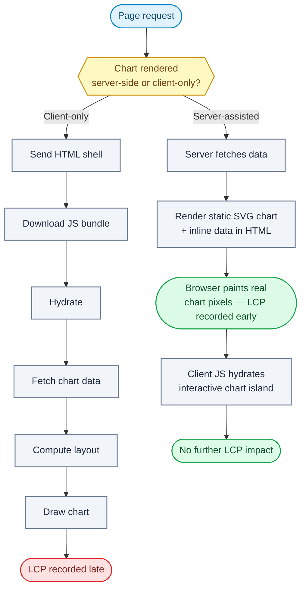

# Question 98

How do you optimize the Largest Contentful Paint (LCP) metric when the primary hero element is a client-rendered chart?

## Summary
**The Problem:** When the hero element is a chart rendered entirely on the client (fetch data → parse → compute layout → draw to Canvas/SVG/WebGL), LCP can't be recorded until all of that work finishes, because the browser has nothing meaningful to paint until the client-side render completes — unlike a hero ``, which paints as soon as the image bytes arrive.

**The Solution:** Move as much of the critical path server-side as possible (server-render a static/placeholder version of the chart, or inline the first-paint data), prioritize the chart's data fetch above other work, and ensure the chart library's actual rendering isn't blocked behind non-critical JavaScript — so real pixels appear as early as possible instead of waiting for the full client-side pipeline.

## Why it matters
LCP measures when the largest visible content element finishes rendering, and for a chart-as-hero page, the chart *is* the LCP candidate. Any client-only rendering pipeline — bundle download, hydration, data fetch, chart library initialization, draw — all sits on the critical path before the LCP timestamp can fire. This is one of the most common causes of poor LCP in dashboards/analytics apps, because "chart libraries as hero content" is inherently anti-SSR unless deliberately engineered otherwise.

## Flowchart


## Key Concepts
- **LCP candidate:** the browser's largest visible element gets tracked as the LCP element — for a canvas/SVG chart, this is often the container element, and it only "counts" as painted once actual pixels are drawn, not just when the empty container exists.
- **Critical path elimination:** every step between "page starts loading" and "chart pixels appear" (JS bundle, hydration, data fetch, computation, draw call) adds to LCP; each step removed or parallelized reduces it.
- **Server-rendered placeholder/skeleton chart:** rendering a static SVG or image snapshot of the chart on the server (or at build time) gives the browser real pixels to paint immediately, with the interactive client version taking over after hydration.
- **Data inlining:** embedding the chart's initial dataset directly in the server-rendered HTML (avoiding a client-side fetch round trip) removes an entire network request from the critical path.
- **Resource prioritization:** using `fetchpriority="high"`, preloading the data endpoint, and deferring non-critical JS so the chart's own bundle and data aren't queued behind unrelated work.

## How to do it
1. Identify the chart container as the LCP element using Chrome DevTools Performance panel / PageSpeed Insights, and confirm what's blocking it (bundle size, fetch waterfall, hydration, draw call).
2. Where possible, server-render (or pre-render at build time) a static image/SVG snapshot of the chart using the same data, so the browser has real pixels to paint before any client JS runs.
3. Inline the chart's initial dataset into the server-rendered HTML (e.g., embedded JSON in a `<script>` tag or RSC payload) instead of triggering a client-side `fetch` after page load.
4. Mark the data-fetch request (if unavoidable client-side) with high priority (`fetchpriority="high"`, or a `<link rel="preload">`/`preconnect` to the API host) so it isn't queued behind lower-priority requests.
5. Split the JS bundle so the chart library and its rendering code load first, deferring unrelated below-the-fold code (analytics, secondary widgets) via code-splitting/lazy loading.
6. Avoid client-side layout thrashing or expensive computation (e.g., recalculating scales/aggregations) blocking the draw call — precompute what can be precomputed server-side.
7. If a true static server-render isn't feasible, show a lightweight, visually representative skeleton (matching final chart dimensions) immediately, then swap in the real chart — this reduces layout shift but does not by itself fix LCP, since the skeleton isn't the final content; use it alongside, not instead of, reducing time-to-real-pixels.
8. Re-measure LCP with field data (CrUX, RUM) since lab tools can't fully capture variance from real network/device conditions affecting the fetch-to-draw pipeline.

## Example
```tsx
// Server Component: fetch data and render a static SVG chart immediately
export default async function HeroChart() {
  const data = await getChartData(); // resolved server-side, no client fetch

  return (
    <>
      {/* Real pixels available at first paint — this is the LCP element */}
      <StaticSvgChart data={data} />
      {/* Hydrates into the interactive version without blocking first paint */}
      <InteractiveChartIsland initialData={data} />
    </>
  );
}
```

## Additional details
- Reserve the chart's exact final dimensions up front (fixed container size, no dynamic resizing after data loads) to avoid layout shift once the interactive version hydrates in.
- `fetchpriority="high"` and `<link rel="preconnect">` to the data API's origin can shave meaningful time off the fetch that gates client-side rendering, if server-rendering isn't an option.
- Canvas/WebGL charts don't paint incrementally the way images do — the LCP timestamp only fires once the full draw call completes, so partial/progressive rendering (draw axes first, then data) can help perceived performance but won't move the LCP metric itself unless the *final* content is what's measured.
- Avoid hydration-blocking work (large synchronous chart library init, unrelated global providers) sitting between "data available" and "draw call executes."

## Why this helps
- Server-rendering a static chart snapshot moves LCP to server response time instead of client compute time, often cutting LCP dramatically.
- Inlining data removes a full request/response round trip from the client-side rendering critical path.
- Prioritizing chart-critical resources ensures the browser doesn't waste bandwidth/CPU on lower-priority work before the hero content is ready.
- Reserved dimensions plus a real first paint avoid trading a fast LCP for a bad CLS.

## Trade-offs
| Aspect | Impact | Description |
|---|---|---|
| Server-rendered static chart | Positive | Best LCP outcome, but requires a server-side rendering path for the chart library or an SVG equivalent. |
| Inlined initial data | Positive | Removes a fetch round trip, but increases initial HTML payload size. |
| `fetchpriority`/preconnect | Positive | Cheap to add, meaningful improvement, but doesn't eliminate client compute time. |
| Skeleton placeholder only | Negative/Neutral | Improves perceived loading and CLS, but does not improve the LCP metric itself since it isn't the final content. |
| Code-splitting chart bundle | Positive | Prioritizes critical rendering path, but adds build/tooling complexity. |

## References
- [web.dev: Largest Contentful Paint (LCP)](https://web.dev/articles/lcp)
- [web.dev: Optimize LCP](https://web.dev/articles/optimize-lcp)
- [MDN: fetchpriority attribute](https://developer.mozilla.org/en-US/docs/Web/HTML/Attributes/fetchpriority)
