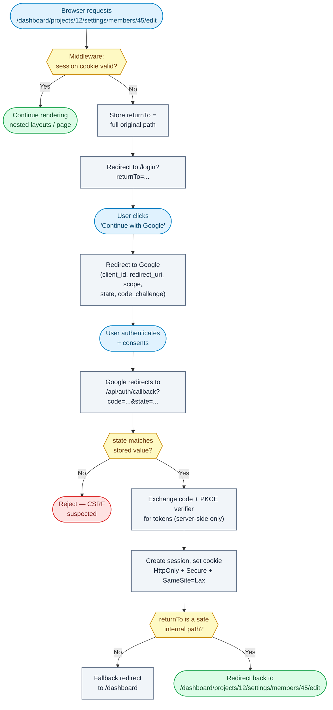

# Question 90

How do you securely handle complex OAuth callback redirects within a deeply nested, authenticated Next.js App Router hierarchy?

## Summary
Authenticate as early as possible (in middleware, before any nested layout renders), remember exactly where the user was headed, and only send them back there once the OAuth handshake is verified. The two hard parts are not losing the deep URL across the redirect, and never trusting that URL blindly when you use it again.

## What matters most
A deeply nested route like `/dashboard/projects/12/settings/members/45/edit` has many layouts stacked on top of it. If auth is checked late, every layout above it may fetch data before you discover the user isn't logged in.

- **Check auth in middleware:** reject before any layout/page work starts, not inside a deeply nested layout.
- **Preserve the destination:** capture the full original path (with query string) before redirecting to login.
- **Never trust it blindly:** validate the stored destination is a same-origin, internal path before redirecting back to it.
- **Keep the OAuth exchange server-only:** client secret, authorization code exchange, and tokens never touch the browser's JS runtime.
- **Session in HttpOnly cookies:** not localStorage/sessionStorage, so XSS can't steal it.

## How to design the flow
1. In `middleware.ts`, check the session cookie for every request matching protected routes (e.g. `/dashboard/:path*`).
2. If unauthenticated, redirect to `/login?returnTo=<encoded original path>` (or store it in a short-lived signed cookie instead of a query param, to avoid leaking it in logs/referrers).
3. `/login` sends the user to the OAuth provider with `client_id`, `redirect_uri`, `scope`, a random `state`, and a PKCE `code_challenge`. Store `state`, the PKCE verifier, and the validated `returnTo` together (signed, HttpOnly cookie).
4. The provider redirects to `/api/auth/callback?code=...&state=...`.
5. In the Route Handler: compare `state` against the stored value, reject on mismatch (CSRF protection).
6. Exchange the authorization code + PKCE verifier for tokens server-side (`POST` to the provider's token endpoint), using the client secret — this never happens in the browser.
7. Create the app session, set it as an `HttpOnly`, `Secure`, `SameSite=Lax` cookie.
8. Read back `returnTo`, validate it, and issue `redirect(returnTo)`.

## Flowchart


## Simple example
```ts
// middleware.ts
export function middleware(req: NextRequest) {
  const isProtected = req.nextUrl.pathname.startsWith('/dashboard');
  const session = req.cookies.get('session')?.value;

  if (isProtected && !session) {
    const returnTo = req.nextUrl.pathname + req.nextUrl.search;
    const loginUrl = new URL('/login', req.url);
    loginUrl.searchParams.set('returnTo', returnTo);
    return NextResponse.redirect(loginUrl);
  }
  return NextResponse.next();
}

export const config = { matcher: ['/dashboard/:path*'] };
```

```ts
// app/api/auth/callback/route.ts
export async function GET(req: NextRequest) {
  const url = new URL(req.url);
  const code = url.searchParams.get('code');
  const stateParam = url.searchParams.get('state');

  const cookieStore = cookies();
  const storedState = cookieStore.get('oauth_state')?.value;
  const verifier = cookieStore.get('oauth_verifier')?.value;
  const returnTo = cookieStore.get('oauth_return_to')?.value ?? '/dashboard';

  if (!stateParam || stateParam !== storedState) {
    return NextResponse.redirect(new URL('/login?error=state_mismatch', req.url));
  }

  const tokens = await exchangeCodeForTokens({ code, verifier }); // server-side only
  const session = await createSession(tokens);

  const safePath = isSafeInternalPath(returnTo) ? returnTo : '/dashboard';

  const res = NextResponse.redirect(new URL(safePath, req.url));
  res.cookies.set('session', session.id, {
    httpOnly: true,
    secure: true,
    sameSite: 'lax',
    path: '/',
  });
  return res;
}

function isSafeInternalPath(path: string): boolean {
  return (
    path.startsWith('/') &&
    !path.startsWith('//') &&
    !path.toLowerCase().startsWith('/\\') &&
    !/^\/(https?:)?\/\//i.test(path)
  );
}
```

## Why this helps
- Middleware runs before any nested layout in `app/dashboard/.../edit` fetches data, so unauthenticated users never trigger wasted project/permission/org lookups.
- Storing `returnTo` server-side (or in a signed cookie) rather than trusting an arbitrary client-supplied value at redirect time closes the open-redirect hole.
- `state` + PKCE stop CSRF and authorization-code interception — both are cheap to implement and provider libraries (NextAuth/Auth.js, Lucia, custom) support them out of the box.
- HttpOnly session cookies mean a successful XSS on a nested page still can't exfiltrate the session token via `document.cookie`.

## Trade-offs
- **Good:**
  - User lands exactly back on the deep page they wanted, no matter how nested.
  - Auth failures are caught before expensive nested data-fetching runs.
  - Standard OWASP protections (open redirect, CSRF, code interception) are addressed by design.
- **Not so good:**
  - More moving pieces than a simple `redirect: '/login'` — state, verifier, and returnTo all need short-lived, signed storage.
  - Middleware can't easily do fine-grained, per-resource authorization (e.g. "does this user own project 12") — that still needs a check in the layout/page for `[projectId]`.
  - Query-param `returnTo` values can leak into logs/analytics; a signed cookie avoids this but adds implementation complexity.

## References
- Next.js Middleware documentation
- OAuth 2.0 Authorization Code Flow with PKCE (RFC 7636)
- OWASP Unvalidated Redirects and Forwards Cheat Sheet
- Auth.js (NextAuth) callback and session documentation
