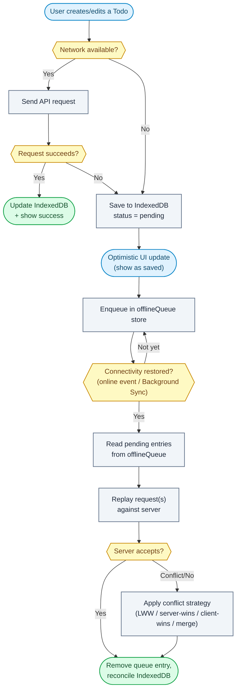

# Question 91

How do you engineer a robust, fully functional offline mode for a web application using Service Workers and IndexedDB?

## Summary
Offline-first is an architecture, not a caching trick: a Service Worker intercepts requests and serves cached assets/pages, IndexedDB stores structured app data and a queue of pending writes, and a sync engine drains that queue (with conflict handling) once connectivity returns. Get these three pieces working together and the app keeps working like Gmail or Notion when the network drops.

## What matters most
Without offline support, a network error while creating a record just loses the user's work. A production-grade offline mode needs more than "cache the page":

- **Separate concerns:** Cache API for HTTP responses (HTML/CSS/JS/images), IndexedDB for structured application data and the pending-write queue.
- **Pick a caching strategy per resource type** — static assets, changing data, and sensitive operations don't want the same strategy.
- **Optimistic UI:** writes save to IndexedDB immediately with `status = pending`, then sync later — the user isn't blocked waiting on the network.
- **Sync on reconnect:** drain the pending queue automatically, don't make the user retry manually.
- **Plan for conflicts up front:** last-write-wins, server-wins, client-wins, manual merge, or CRDTs — pick based on the data, not by accident.
- **Never cache or store secrets:** no access tokens in IndexedDB/localStorage/Cache API; sessions stay in Secure, HttpOnly cookies.

## How to design the architecture
1. Register a Service Worker; on `install`, precache the app shell (HTML/CSS/JS/fonts/offline fallback page).
2. On `activate`, delete stale cache versions from previous deployments and take control of open pages.
3. On `fetch`, apply the right strategy per request type (see below) — check cache, fall back to network, or vice versa.
4. In IndexedDB, create object stores for app data (`todos`, `messages`, `settings`) plus one `offlineQueue` store for pending mutations.
5. Every write goes through a single function: try the network; if it fails (or the app is offline), write to IndexedDB with `status: pending` and enqueue it, then update the UI optimistically.
6. Listen for `online` events (and/or the Background Sync API) to trigger a sync pass: read the queue, replay requests against the server, and on success remove the queue entry and reconcile local data.
7. When the server rejects or the record was modified elsewhere, run the app's conflict-resolution strategy before removing the queue entry.
8. Validate all synchronized data server-side regardless of what the client claims — the client queue is not a trusted source of truth.

## Flowchart


## Caching strategies by resource type
| Strategy | Used for | Behavior |
|---|---|---|
| Cache First | images, fonts, logos, static assets | check cache, return immediately if found, else fetch and cache |
| Network First | dashboards, feeds, frequently changing content | try network, update cache on success; fall back to cache if offline |
| Stale While Revalidate | profiles, product lists | return cached copy instantly, refetch in background, update cache for next visit |
| Cache Only | app shell, offline fallback page | never hits the network |
| Network Only | payments, auth, sensitive writes | always requires a live connection, never cached |

## Simple example
```js
// sw.js — install: precache the app shell
self.addEventListener('install', (event) => {
  event.waitUntil(
    caches.open('shell-v1').then((cache) =>
      cache.addAll(['/', '/offline.html', '/app.js', '/app.css'])
    )
  );
});

// activate: drop stale cache versions
self.addEventListener('activate', (event) => {
  event.waitUntil(
    caches.keys().then((keys) =>
      Promise.all(keys.filter((k) => k !== 'shell-v1').map((k) => caches.delete(k)))
    )
  );
});

// fetch: cache-first for static assets, network-first for API data
self.addEventListener('fetch', (event) => {
  const { request } = event;
  if (request.destination === 'image' || request.destination === 'font') {
    event.respondWith(
      caches.match(request).then((cached) => cached || fetch(request))
    );
    return;
  }
  if (request.url.includes('/api/')) {
    event.respondWith(
      fetch(request)
        .then((res) => {
          const clone = res.clone();
          caches.open('api-v1').then((cache) => cache.put(request, clone));
          return res;
        })
        .catch(() => caches.match(request))
    );
  }
});
```

```js
// db.js — write-through with an offline queue (using idb wrapper)
async function saveTodo(todo) {
  const db = await openDB();
  try {
    const saved = await fetch('/api/todos', {
      method: 'POST',
      body: JSON.stringify(todo),
    });
    await db.put('todos', { ...todo, status: 'synced' });
    return saved;
  } catch {
    await db.put('todos', { ...todo, status: 'pending' });
    await db.add('offlineQueue', { type: 'create-todo', payload: todo, ts: Date.now() });
  }
}

window.addEventListener('online', syncQueue);

async function syncQueue() {
  const db = await openDB();
  const pending = await db.getAll('offlineQueue');
  for (const entry of pending) {
    try {
      await fetch('/api/todos', { method: 'POST', body: JSON.stringify(entry.payload) });
      await db.delete('offlineQueue', entry.id);
    } catch {
      // still offline or server rejected — leave in queue, retry next sync
    }
  }
}
```

## Why this helps
- Precaching the app shell means the app boots even with zero network, instead of showing a browser error page.
- Splitting Cache API (HTTP responses) from IndexedDB (structured data + queue) matches each store to what it's actually good at.
- Optimistic UI plus a persistent queue means a page refresh or closed tab doesn't lose pending work — it's sitting in IndexedDB, not memory.
- Deciding the conflict strategy per data type up front (e.g. LWW for a todo title, manual merge for collaborative docs) avoids silently discarding a user's edits.
- Keeping tokens out of IndexedDB/localStorage limits what an XSS attacker or someone with local device access can steal even if they get to poke at the local database.

## Trade-offs
- **Good:**
  - App remains usable through flaky or fully absent connectivity.
  - Users perceive fast, instant interactions from optimistic updates.
  - Data resilience across refreshes and browser restarts.
- **Not so good:**
  - Meaningfully more code: cache versioning, queue management, retry logic, conflict resolution.
  - Background Sync API support is inconsistent across browsers, so you still need a fallback sync-on-open path.
  - Conflict resolution is genuinely hard to get right for anything beyond simple last-write-wins fields — collaborative editing effectively needs CRDTs/OT.
  - Storage isn't infinite; large datasets need pagination, indexing, and periodic cleanup to avoid bloating the browser's storage quota.

## References
- MDN: Service Worker API
- MDN: IndexedDB API
- web.dev: Offline Cookbook (caching strategies)
- Workbox (Google) — production Service Worker toolkit
- Background Sync API specification
